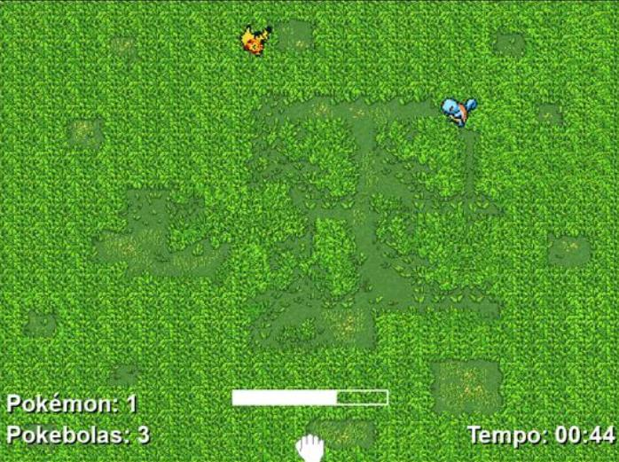
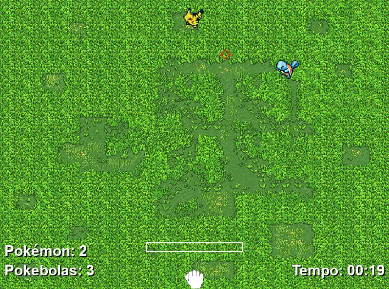

```markdown
# Pokémon Go 2

## Descrição do Projeto
O **Pokémon Go 2** é um jogo desenvolvido com técnicas de orientação a objetos, onde o jogador captura Pokémon usando Pokébolas. O jogo oferece uma experiência interativa com elementos como medidor de força, mira e contador de tempo.

## Atributos e Funcionalidades do Jogo
- **Jogador**: Representa o personagem principal que arremessa Pokébolas para capturar Pokémon.
- **Pontuação**: Contabiliza o número de Pokémon capturados pelo jogador.
- **Chances**: Atualiza o total de chances disponíveis para o jogador durante a partida.
- **Mapa**: Cria e renderiza o ambiente do jogo na tela.
- **Medidor de Força**: Determina a força do arremesso da Pokébola.
- **Mira**: Auxilia o jogador na direção dos arremessos.
- **Pokémon**: Criaturas do jogo que podem ser capturadas pelo jogador.
- **Pokébolas**: Itens utilizados para capturar Pokémon.
- **Tempo**: Controla o tempo restante para o jogo e o tempo adicional ganho com a captura de Pokémon.

## Tecnologias Utilizadas
- **Python**: Linguagem de programação principal.
- **Pygame**: Biblioteca utilizada para desenvolvimento de jogos.

## Desenvolvedores
👤 **Gabriel Ferreira**  
👤 **Pedro Raulino**  
👤 **Jose Carlos**  
👤 **Renato**

## Funcionalidades do Sistema
- **Iniciar Jogo**: Começa uma nova partida e inicia a contagem do tempo.
- **Arremessar Pokébola**: Permite ao jogador arremessar Pokébolas para capturar Pokémon.
- **Atualizar Tempo**: Atualiza o tempo restante com base no tempo decorrido e na captura de Pokémon.
- **Mostrar Pontuação**: Exibe o número atual de Pokémon capturados e a pontuação total.
- **Mostrar Tempo Restante**: Exibe o tempo restante na tela do jogo.
- **Gerenciar Eventos**: Trata eventos de teclado e mouse para controlar as ações do jogo.
- **Reiniciar Jogo**: Permite que o jogador reinicie o jogo ou saia da aplicação.

## Como Executar o Projeto
1. **Clone este repositório**:
   ```bash
   git clone https://github.com/GabasDev/poo-game-project
   ```
2. **Navegue para o diretório do projeto**:
   ```bash
   cd poo-game-project
   ```
3. **Instale as dependências necessárias**:
   ```bash
   pip install pygame
   ```
4. **Execute o jogo**:
   ```bash
   python main.py
   ```

## Capturas de Tela


*Tela do Jogo 1*


*Tela do Jogo 2*

## Contribuições
Contribuições são bem-vindas! Se você deseja contribuir para este projeto, siga estas etapas:
1. Faça um fork do repositório.
2. Crie uma branch com sua feature ou correção (`git checkout -b minha-feature`).
3. Commit suas alterações (`git commit -am 'Adiciona nova feature'`).
4. Envie suas alterações para o repositório remoto (`git push origin minha-feature`).
5. Envie um pull request.